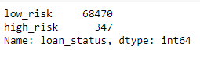
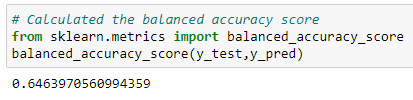
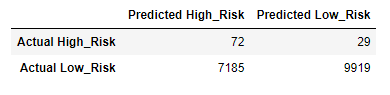
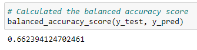
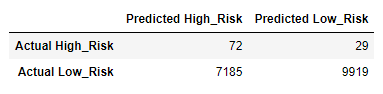
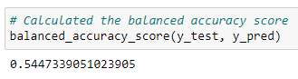
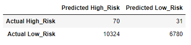
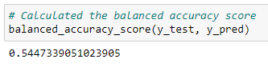
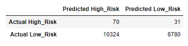

# Credit_Risk_Analysis

# Overview of the analysis
- For this analysis we are using imbalanced-learn and scikit-learn libraries to build models and evalue them using a resampling method to predict credit risk from our loan stats data. We focused on using supervised learning with our dataet to achieve these predictions. 

# Results

## Deliverable 1
- For our dataset we using the loan status column to determine if a application are low or high risk credit application. As shown in the in the image below you can see that about 99% of applications were considered to be low risk. 

- Using the RandomOverSampler model the results we achieved a balanced accuracy score of 64%.

- Results from using RandomOverSampler model

- Using the SMOTE model had a slightly higher balanced accuracy score of 66%

- Results from using SMOTE model

## Undersampling

- Using the ClusterCentroids Model had a lower balanced accuracy score of 54%

- Results from using the CluisterCentroids Model

## Deliverable 2

- We used the SMOTEENN model that combines both oversampling and undersampling. 

- SMOTEENN balanced accuracy score of 54%

- Results using the SMOTEENN model

# Summary

- As shown in the examples above the SMOTE model achieved the highest balanced accuracy score of 66% and the lowest being the SMOTEENN model. I believe that machine learning is a great tool that can be used in a variety of different applications to make predictions.

